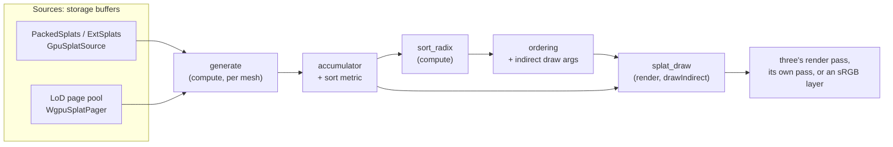

# WebGPU architecture

This page is for people working on Spark's WebGPU backend: how a frame is drawn, where the GPU code lives and how it gets to WGSL, and the rules the code follows. For using the backend see [WebGPU backend](webgpu.md).

The code is in `src/webgpu/` (TypeScript), `slang/` (GPU code in Slang), `src/dyno/wgsl/` (the dyno WGSL backend) and `tools/slang-build/` (the Slang toolchain). The GPU tests in `test/gpu/` run the kernels on a real adapter through Dawn's Node bindings (`npm run test:gpu`).

## The pipeline

Each frame has three stages, like WebGL Spark's: generate the splats of every mesh into one accumulator, sort them back to front, and draw them.



- **Generate** (`slang/kernels/generate.slang`) runs one thread per output splat of a mesh. It remaps the index through the mesh's LoD indices, reads the source splat (packed or ext) or calls the mesh's dyno generator, adds the spherical-harmonics colour for the view direction, runs object modifiers, transforms to world space, applies `recolor`, runs world modifiers, and writes the splat into the accumulator with its sort metric. Splats that are inactive, that a modifier drops, or that the draw would skip anyway (centre outside the `clipXY` frustum or behind the camera, alpha under `minAlpha`: `GEN_CULL`, the `cull` option) get an infinite metric. Each mesh writes its own range of the accumulator (`outBase`).
- **Sort** (`slang/kernels/sort_radix.slang`, `GpuSorter.ts`) turns the metrics into keys (the inverted float bits, so the farthest comes first, with inactive splats last) and sorts them with a stable LSD radix sort, 4 bits per pass: per-block histograms, a multi-level scan, and a stable scatter. First it counts the splats with a finite metric and compacts their keys in index order, so the radix passes run as indirect dispatches over the visible splats only. It uses no subgroup operations: stability inside a block comes from a workgroup scan of the 16 digit counters packed into a `uint4`. The count of active splats goes straight into the indirect draw arguments, so the CPU never reads anything back. `sortBits` (32, 24 or 16) sets how many key bits are sorted.
- **Draw** (`slang/draw/splat_draw.slang`) draws one instance per sorted splat, four vertices as a triangle strip, with `drawIndirect`. It ports `splatVertex.glsl` and `splatFragment.glsl` to WebGPU's clip space: covariance projection, the anti-aliasing blur, LoD opacity, 2DGS and covariance splats, depth of field, falloff and the portal disk clip.

`WgpuSplatRenderer` (`src/webgpu/WgpuSplatRenderer.ts`) drives the three stages for a list of meshes. It has two ways to draw:

- `render(camera, target?)` opens its own render pass over what three rendered into `target` (a `RenderTarget` whose `depthTexture` occludes the splats), or onto the canvas.
- `renderInPass(camera, pass, target)` submits generate and sort at once, so they run before the caller's command buffer, and records the draw into a render pass someone else opened, with a pipeline built for that pass's formats and sample count.

`SparkWebGPU` (`src/webgpu/SparkWebGPU.ts`) is `SparkRenderer` on three.js's `WebGPURenderer`. The `SparkRenderer` mesh stays in the scene with an empty geometry three never draws, but three still calls its `onBeforeRender` while it records its pass, between the opaque objects and the transparent ones sorted after it. There `SparkWebGPU` maps the scene's visible `SplatMesh`es and `SplatGenerator`s to `WgpuSplatRenderer` meshes (uploads shared between meshes drawing the same splats, LoD and paged meshes through `WgpuLod`, modifiers through `splatMeshDyno`) and draws:

- **into three's open pass** (`renderInPass`) for render targets and post-processing passes, testing against three's depth;
- **on the canvas**, three renders into a linear half-float target. To blend in sRGB as WebGL Spark does, `SparkWebGPU` ends three's pass, draws the splats over an 8-bit layer that starts as the target as the canvas would hold it, `q(srgb(clamp(dst)))`, with the transmittance T in alpha, so each blend rounds as WebGL's does; writes back `linear(layer + T · (srgb(clamp(dst)) − q(…)))`, which leaves uncovered pixels exact (`SrgbComposite.ts`), and resumes three's pass, as three's own `copyFramebufferToTexture` does;
- **after three's output pass** when tone mapping is on, so that splats aren't tone mapped. A multisampled scene depth is first copied to a single-sample texture (`DepthResolve.ts`), since WebGPU can't resolve depth.

This reaches into three.js r180 internals (the current render context, the backend's per-resource data and utils, and its pipeline cache), declared as narrow interfaces at the top of `SparkWebGPU.ts`.

When the GPU sort doesn't fit the device (see [Capabilities](#capabilities)), or with `sort: "cpu"`, the renderer reads the metrics back and sorts them in JS (`cpuSort.ts`), drawing a frame behind as WebGL Spark does.

### Tile rasterizer (experimental)

`WgpuSplatRenderer({ rasterizer: "tiles" })` replaces the quad draw of `render()` with a compute rasterizer after the reference 3DGS one (`slang/tiles/tile_raster.slang`, `TileRasterizer.ts`). Generate and the depth sort are unchanged. Then, per sorted splat, it computes the footprint with the quad draw's own maths (`slang/draw/splat_shape.slang`, shared with `splat_draw`), lists the splat in every 16×16 tile its ellipse reaches (an exclusive scan of the counts gives each splat's offset), and sorts the (tile, slot) pairs stably by tile alone with `GpuSorter`. The slots are already back to front, so each tile's list stays in depth order. One workgroup per tile then blends its list front to back into an `rgba16float` texture, testing three's depth texture in compute, and stops once every pixel's transmittance is under 1/255. Last, a full-screen pass composites the image with the quad draw's blend state (or into the sRGB layer). There are no float atomics and no subgroups.

The image matches the quad draw to within a level: a mean difference of 0.3–0.5/255 on the example scenes, mostly because the quads round to 8 bits at every blend and the tiles round once. 2DGS splats, draw stages (attributes) and `renderInPass` stay on the quad draw. The pair buffers are sized from a readback a frame or two behind.

On Apple GPUs it pays off only where many splats pile up on a pixel and early termination skips most of them. In Chrome on an Apple GPU, dense synthetic clouds (1–4M splats, and close-ups) reach 1.8–4.4× the frame rate. Captured scenes (penguin, valley, robot-head) are 1.1–1.7× slower, because a tile blends all 256 of its pixels for each listed splat, where the rasterizer shades only covered fragments. It stays opt-in.

### Choosing per frame: `rasterizer: "auto"`

`rasterizer: "auto"` (`AutoRasterizer.ts`) draws each frame on whichever path the GPU runs faster, by timing them. Nothing cheap computed before the draw predicts the order: pairs per tile is no higher on the synthetic clouds the tiles win than on the captured scenes the quads win, since it ignores early termination and fragment counts.

- **Timing.** `DrawTimer` stamps the end of a one-thread marker pass after the sort and the end of the draw's last pass (a pass's beginning can be stamped before the passes ahead of it finish on Apple GPUs; an empty pass, or one stamping only its end, gets no timestamps). Frames are read back in batches of four on one path; a batch's sample is its median span, or the mean period between consecutive draws' ends when less, since spans stretch when an unthrottled loop overlaps frames. The current path is timed one batch in 16 frames.
- **Probes.** The other path is drawn for four frames, after 30 frames, then at intervals doubling to 960 while it loses; the interval drops back to 30 when the current path's time moves by more than the gap the last probe saw (1.25–2×), the only case where the order may have flipped. A switch needs the other path 10% and 0.2 ms faster. A probe of the tiles first runs the tile stages once untimed on a quad frame and waits for their pair count, so a probe never drops pairs. The two paths agree to about 0.5/255, so probes and switches don't show.
- **Without `timestamp-query`** it draws hardware. With `profile: true` it reads the profiler's frame span instead.
- `stats.rasterizer` is the path the last draw took, `stats.auto` the policy's state (estimates, probes, switches, interval).

Readbacks lag the GPU queue: a few frames when paced, but seconds in an unthrottled headless loop (0.5 s on penguin, 15 s on the 4M cloud), and auto settles only after a few of them. Paced (`__bench`, each frame waited on), in Chrome on an Apple GPU at 1280×720, it settled on the faster path in 21 of 21 runs. Median frame ms of 3 interleaved runs, with other work on the GPU:

| Scene | hardware | tiles | auto |
| --- | --- | --- | --- |
| 1M synthetic | 11.3 | 6.8 | 6.0 |
| 2M synthetic | 25.6 | 11.3 | 16.5 |
| 4M synthetic | 70.0 | 21.6 | 26.0 |
| 1M close-up | 37.8 | 10.1 | 10.2 |
| penguin | 2.9 | 4.1 | 2.5 |
| valley | 5.6 | 7.8 | 3.9 |
| robot-head | 2.6 | 3.3 | 2.0 |

The default stays `"hardware"`: auto needs `timestamp-query`, and in an unthrottled loop dense scenes stayed on the quads for over 15 s, slower than hardware while they waited.

## Buffer layouts and the 8-storage-buffers rule

WebGPU guarantees only 8 storage buffers per shader stage, and that is what Safari gives by default. So per-splat data is **interleaved**, one buffer per kind of data, and no kernel binds more than 5 storage buffers:

| Buffer | Packed | Ext |
| ------ | ------ | --- |
| `src` (source splats) | 1 × `uint4` (16 bytes) | 2 × `uint4` (32 bytes) |
| `sh` (spherical harmonics) | 3 × `uint4`: sh1 (2 words + pad), sh2, sh3 | 4 × `uint4`: sh1, sh2, sh3a, sh3b |
| `outSplats` (accumulator) | as `src`, in the accumulator's format | as `src` |
| `lodIndices` | 1 × `uint` per output splat | |
| `sortMetric` | 1 × `float` per accumulator slot | |

Generate binds those five. The draw's vertex stage binds two (`ordering`, `splats`), the attribute gather four.

The accumulator is ext (32 bytes per splat) while it fits one storage binding, and packed (16 bytes, centres relative to the camera, `outOrigin`) above that, which doubles the splats a frame can hold (`accumulator: "ext" | "packed" | "auto"`). Generate writes either (`GEN_OUT_EXT`) and the draw reads either (`DRAW_EXT`).

The same rule shapes the rest of the backend:

- **Attributes** of any schema live in one buffer that carries its own descriptor table (see [Attributes](#attributes)), not a buffer per attribute.
- **Pages** of the LoD pool are ranges of one buffer per kind of data (core, SH), not a buffer per page.
- **Dyno textures** are textures, not storage buffers, so they don't count against the limit.

`GpuSplatSource` (`src/webgpu/GpuSplatSource.ts`) uploads PackedSplats and ExtSplats arrays, with their SH, in this layout.

## The Slang toolchain

GPU code is written in [Slang](https://shader-slang.org) under `slang/`:

| Directory | What |
| --------- | ---- |
| `slang/core/` | Modules with no entry points: splat codecs (`packed`, `ext`, `quat_codec`), `sh`, `math`, `cov`, `attrib`, `splat_types`, `dyno_hooks` |
| `slang/kernels/` | Compute kernels: `generate`, `sort_radix`, `attrib_gather`, `pool_restride` |
| `slang/draw/` | Render pipelines: `splat_draw`, `splat_attrib_draw` |
| `slang/fx/` | aofx effect kernels and the texture bridge (see [WebGPU effects](webgpu-fx.md)) |
| `slang/tests/` | Kernels for the GPU tests |

`tools/slang-build` compiles every `.slang` file that has entry points to WGSL with `slangc`, and writes `src/webgpu/generated/<path>.ts` exporting the WGSL and its reflection:

```typescript
import generateModule from "./generated/kernels/generate";
generateModule.wgsl;        // the WGSL
generateModule.reflection;  // { entries, bindings }
```

The reflection follows the aofx SDK's kernel trailer (`AofxKernelTrailer.cmake`): each entry's name, stage and workgroup size, and each binding's group, index and kind, with the element size of a storage buffer and the size and fields (offset, scalar type, components) of a uniform block. slangc's reflection doesn't always say which bindings an entry uses, so slang-build compiles each entry on its own as well and records the bindings its WGSL declares (`uses`).

The integer `static const`s of every `.slang` file (flags, format codes, enumerations) also go to `src/webgpu/generated/constants.ts`, one object per file (`kernelsGenerate`, `coreAttrib`, `fxMerge`...), so host code reads them from there instead of repeating them:

```typescript
import { kernelsGenerate } from "./generated/constants";
const flags = kernelsGenerate.GEN_USE_LOD | kernelsGenerate.GEN_OUT_EXT;
```

The generated files are committed, so building Spark doesn't need slangc. After changing a `.slang` file run `npm run build:slang` (slangc is looked for in `$SLANGC`, `$SLANG_ROOT/bin` and `~/tools/slang/bin`) and commit the result; `npm run check:slang` fails if a generated file is stale. In Vite's dev server the `slangBuild()` plugin rebuilds on `.slang` changes, and skips slangc when no `.slang` file is newer than the generated modules.

### KernelRegistry and UniformWriter

`KernelRegistry` (`src/webgpu/KernelRegistry.ts`) builds compute pipelines and explicit bind group layouts from a generated module's reflection, once per entry. As in aofx's `Gpu::run`, a dispatch names its buffers by their Slang names, its grid counts threads (the registry divides by the workgroup size), and a dispatch whose buffers or uniform block disagree with the kernel is refused with an error that names the binding, instead of rendering black:

```typescript
const kernel = registry.get(generateModule, "generate");
kernel.dispatch(pass, {
  grid: [count],
  buffers: { src, sh, lodIndices, outSplats, sortMetric },
  uniforms: UniformWriter.for(generateModule).setAll({ numSplats: count, flags }).data,
});
```

Uniform blocks of the dispatches recorded before a submit share a `UniformArena`, each at its own offset (aligned to `minUniformBufferOffsetAlignment`). Submit through `registry.submit(...)`, which frees the arena for the next batch.

`UniformWriter` (`src/webgpu/uniforms.ts`) packs a uniform block by field name, at the offsets and with the scalar types the reflection gives, so host code never mirrors a Slang struct by hand. Fields left out are zero and an unknown name throws. Matrices are passed as `float4` columns, which avoids layout rules that differ between Slang, WGSL and the host.

`createReflectedRenderPipeline` (`src/webgpu/renderPipeline.ts`) does the same for a vertex and fragment entry pair, and `gpuBuffers.ts` has the small buffer and texture helpers the modules share.

## Dyno graphs in WGSL

Dyno graphs are built at run time, so they can't be compiled offline with the kernels. Instead the kernels have **hooks**: `slang/core/dyno_hooks.slang` declares `dynoSource`, `dynoObjectModifier`, `dynoWorldModifier`, `dynoCovObjectModifier` and `dynoCovWorldModifier` as `[noinline]` pass-through functions, which `generate.slang` calls at the right points.

1. `src/dyno/wgsl` compiles a mesh's generator and modifier graphs to WGSL functions (`WgslDynoProgram`). Dyno ops emit GLSL; ops whose GLSL is valid WGSL once constructor names are mapped use it as it is, the rest register WGSL emitters (`ops.ts`), plain user dynos have their GLSL translated (`glslParse.ts`, `glslToWgsl.ts`, registered from the WebGPU chunk), and dynos may give `wgsl: { globals, statements }` instead. Uniforms go into one uniform block whose names resolve to its fields; sampler uniforms become texture and sampler bindings.
2. `patchKernel` (`src/webgpu/dyno/patchKernel.ts`) finds each hook function slangc emitted in the generate WGSL (`dynoObjectModifier_N`) and replaces its body with a call to the graph's function, converting between the kernel's `Gsplat` (which may carry extra fields) and dyno's. The dyno uniform block and textures become "external" bindings in group 1.
3. `DynoKernels` (`src/webgpu/dyno/DynoKernels.ts`) caches one pipeline per distinct generated code, so meshes with the same graph structure share it while each keeps its own uniform values. `changed()` compares a mesh's uniform bytes, texture versions and graphs with the last frame's, for frame skipping.

`splatMeshDyno(mesh)` and `splatGeneratorDyno(generator)` (`src/webgpu/dyno/adapters.ts`) build a mesh's dyno set the way `SplatMesh` does on WebGL: skinning, edits, `objectModifiers`, `worldModifiers`, `splatRgba`, and the covariance variants with `covSplats`.

## LoD and paging

`WgpuLod` (`src/webgpu/WgpuLod.ts`) runs the same LoD traversal as `SparkRenderer`, the Rust/WASM code in a worker, with the same budget, foveation and `lodScale` options. Its result for each mesh becomes the mesh's index list (`WgpuSplatRenderer.setLodIndices`), and generate remaps through it (`GEN_USE_LOD`). LoD PackedSplats and ExtSplats draw their `lodSplats`.

Paged `.rad` files go through `WgpuSplatPager` (`src/webgpu/WgpuSplatPager.ts`), which keeps `SplatPager`'s fetch queue, page LRU and tree updates but holds pages in storage buffers: page `p` is splats `[p · 65536, (p + 1) · 65536)` of one pool buffer per kind of data, in generate's layout. The traversal already returns pool indices, so a paged mesh is drawn as an ordinary source over the whole pool, remapped through its indices, with no kernel change. The pool is capped by `maxStorageBufferBindingSize`; `WgpuLod` marks the renderer dirty after page uploads. The SH pool's stride follows the SH degrees the pages carry (`GpuSplatSource.shStride`), and widens through `slang/kernels/pool_restride.slang` when higher degrees arrive. A third pool, `PagedAttribPool`, pages per-Gaussian attributes.

## Attributes

Per-Gaussian attributes (`src/webgpu/attributes/`, `slang/core/attrib.slang`) are described in [Per-Gaussian attributes](webgpu-attributes.md). Inside the renderer they are a `SplatRendererStage`, an optional hook around the core passes:

- after generate, `slang/kernels/attrib_gather.slang` copies each mesh's `toDraw` attributes into a draw pool indexed like the accumulator, with the same LoD remap, converting formats and turning direction attributes with the object;
- the draw is replaced by `slang/draw/splat_attrib_draw.slang`, which calls `splat_draw.slang`'s stages, reads attributes into flat varyings and writes extra render targets for picking.

## aofx effects

`src/webgpu/fx/` runs effects written against the aofx SDK's effect model, on their Slang kernels unchanged, over a texture: `Effect` and `RenderRequest` as in the SDK, a `Gpu` that checks dispatches the way an aofx host does, `FxGraph` for regions and channel switches, `TextureBridge` between textures and the picture layout, and `FxChain` to apply a list of effects to a render target. See [WebGPU effects](webgpu-fx.md).

## Capabilities

`capabilitiesOf(device)` (`src/webgpu/capabilities.ts`) reads a device's (or adapter's) features and limits into what Spark needs: whether the sort's 256-thread workgroups and 4.2 KiB of workgroup storage fit, how many splats one binding holds (`maxSplats`, and `maxSplatsWithSh`), whether the vertex stage may read storage buffers, and the optional features (subgroups, timestamp queries, `float32-filterable`, `shader-f16`), which are reported but never assumed. `WgpuSplatRenderer` consults it to fall back to the CPU sort and to refuse an over-limit splat count by name. `splatRequiredLimits(adapter)` lists the limits worth requesting.

## Profiling

`WgpuSplatRenderer({ profile: true })` times generate, each sort stage and the draw with timestamp queries (`GpuProfiler.ts`) into `stats.gpuMs`, where the device has the `timestamp-query` feature. It splits the sort into a pass per stage, so it costs a little. `compare-webgpu.html?profile=1` exposes it as `window.__profile(frames)`. Besides each label, `total` sums the passes and `span` runs from the first start to the last end. On Apple GPUs passes can overlap: a render pass may start its timer while the compute before it is still running, which is the case for the tile rasterizer's composite. The pass times are then only indicative, and frame rates or `span` are the numbers to compare.

## Frame skipping

Like `SparkRenderer`, `WgpuSplatRenderer` regenerates and re-sorts only when something that affects the result changed. Each frame it builds a signature of the camera's matrices, every mesh's world matrix, `recolor` and source version, the mesh set (and LoD indices), and the sort settings, and compares it with the last one. Dyno meshes also report whether their uniforms, textures or graphs changed (`DynoKernels.changed`). On an unchanged frame it only draws, with the last order. `markDirty()` forces the next frame to regenerate (`WgpuLod` calls it after page uploads), and `alwaysGenerate` turns skipping off.

## Adding a kernel

1. Write the kernel in Slang under `slang/kernels/` (or `slang/draw/` for a render pipeline). Mark entries with `[shader("compute")]` and `[numthreads(...)]`, declare buffers as `StructuredBuffer<T>` / `RWStructuredBuffer<T>` and parameters as one `ConstantBuffer<Params> params`. Interleave per-splat data so the entry binds at most 8 storage buffers (Spark's kernels keep to 5). Import what you need from `slang/core/`, and put flags and enumerations in `static const uint`s.
2. Run `npm run build:slang` and commit `src/webgpu/generated/kernels/<name>.ts` and `constants.ts`.
3. Dispatch it through the registry, packing uniforms with `UniformWriter` and reading constants from `generated/constants.ts`:

    ```typescript
    import { kernelsMyKernel } from "./generated/constants";
    import myModule from "./generated/kernels/my_kernel";

    const kernel = registry.get(myModule, "myEntry");
    const pass = encoder.beginComputePass();
    kernel.dispatch(pass, {
      grid: [count],
      buffers: { input, output },
      uniforms: UniformWriter.for(myModule)
        .setAll({ count, flags: kernelsMyKernel.MY_FLAG })
        .data,
    });
    pass.end();
    registry.submit(encoder.finish());
    ```

4. Add a test in `test/gpu/` that runs it on Dawn (`test/gpu/device.ts` gives a device, `storage()` and `readBack()`) against a CPU reference, and run `npm run test:gpu`.
5. If the kernel needs a limit or a feature beyond the defaults, check it in `capabilities.ts` and fall back where it's missing.
